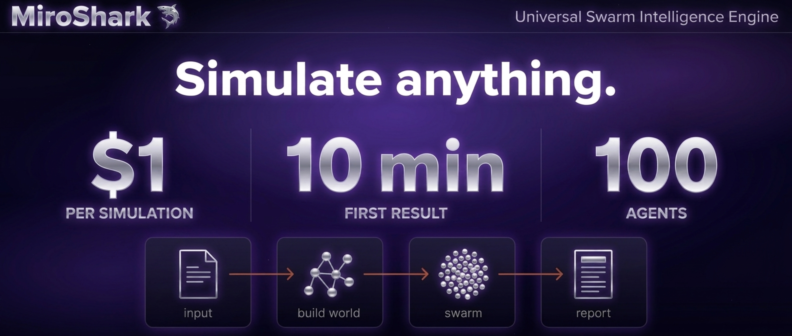
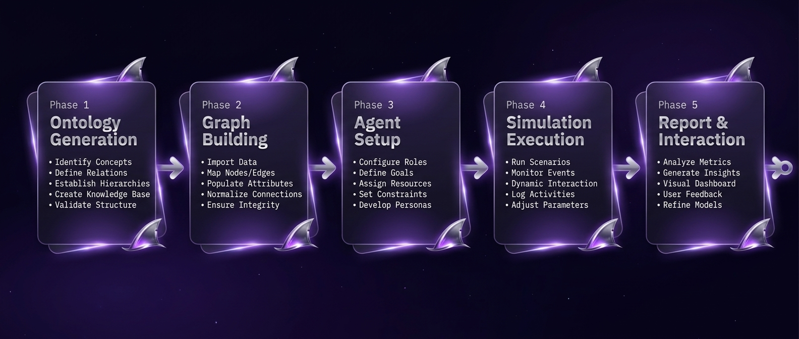
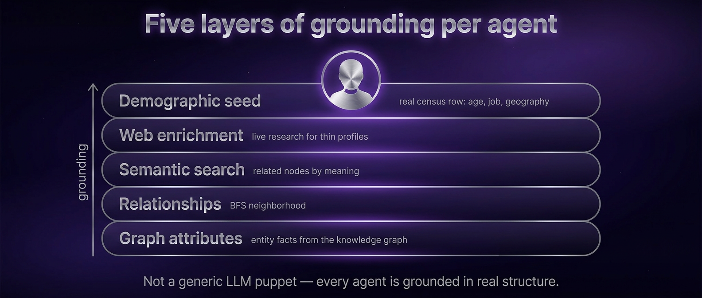
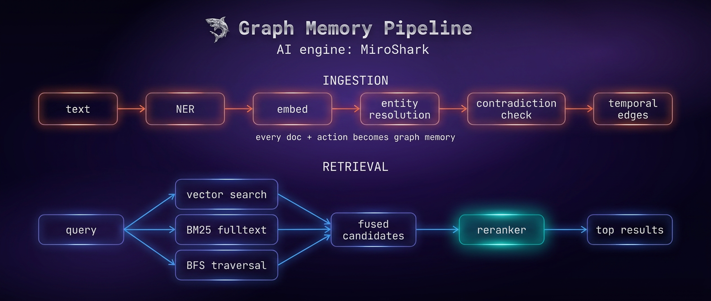
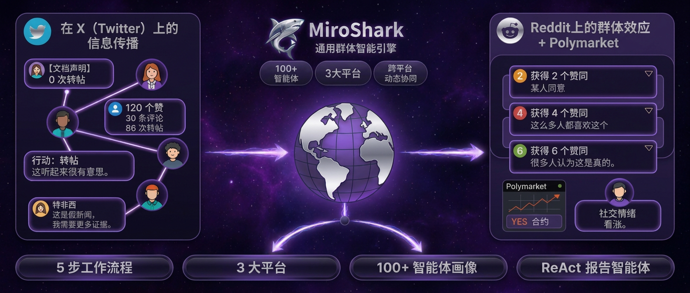

<p align="center">
  
</p>

<h1 align="center">MiroShark</h1>

<p align="center">
  <a href="https://github.com/aaronjmars/MiroShark/stargazers"></a>
  <a href="https://github.com/aaronjmars/MiroShark/network/members"></a>
  <a href="https://x.com/miroshark_"></a>
  <a href="https://bankr.bot/discover/0xd7bc6a05a56655fb2052f742b012d1dfd66e1ba3"></a>
</p>

<p align="center">
  <a href="#english">English</a> · <a href="#中文">中文</a>
</p>

<p align="center">
  
</p>

---

<a id="english"></a>

## English

> **Simulate anything, for $1 & less than 10 min — Universal Swarm Intelligence Engine**
> Drop in anything — a press release, a news headline, a policy draft, a question you can't answer, a historical what-if — and MiroShark spawns hundreds of agents that react to it hour by hour. Posting, arguing, trading, changing their minds.

<p align="center">
  
</p>

### What it does

- You bring a scenario. MiroShark builds the world around it.
- Hundreds of grounded agents. Twitter, Reddit, and a prediction market. Hour by hour.
- Chat with any of them. Drop breaking news mid-run. Fork the timeline.
- Get a report on what happened, citing actual posts and trades.

<p align="center">
  
</p>

### Quick start

The recommended path: **one [OpenRouter](https://openrouter.ai/) key + the `./miroshark` launcher.** First simulation in ~10 min, ~$1.

**Prereqs** — Python 3.11+, Node 18+, Neo4j, and an [OpenRouter key](https://openrouter.ai/).

Install Neo4j — the launcher starts it for you:

- **macOS** — `brew install neo4j`
- **Linux** — `sudo apt install neo4j` *(or your distro's equivalent)*
- **Windows** — install [Neo4j Desktop](https://neo4j.com/download/) *(native, GUI — start the DB there, then run the launcher from WSL2 or Git Bash)*, or run the whole stack inside [WSL2](https://learn.microsoft.com/windows/wsl/install) and follow the Linux steps
- **Zero-install** — create a free [Neo4j Aura](https://neo4j.com/cloud/aura-free/) cloud instance and point `NEO4J_URI` / `NEO4J_PASSWORD` at it in `.env`

Then:

```bash
git clone https://github.com/aaronjmars/MiroShark.git && cd MiroShark
cp .env.example .env
# Paste your OpenRouter key into the LLM_API_KEY / SMART_API_KEY /
# NER_API_KEY / OPENAI_API_KEY / EMBEDDING_API_KEY slots (same key,
# 5 places). Default lineup is Mimo V2 Flash + Gemini 3 Flash.
./miroshark
```

The launcher checks dependencies, starts Neo4j, installs frontend + backend, and serves `:3000` + `:5001`. Ctrl+C stops everything. Open `http://localhost:3000` and drop in a document.

**Other paths** — [one-click Railway / Render deploy](docs/INSTALL.md#one-click-cloud), [Docker + Ollama](docs/INSTALL.md#option-b-docker--local-ollama), [manual Ollama](docs/INSTALL.md#option-c-manual--local-ollama), [Claude Code CLI](docs/INSTALL.md#option-d-claude-code-no-api-key) — all in **[docs/INSTALL.md](docs/INSTALL.md)**.

<p align="center">
  
</p>

### Interface language

After launching, click the **中 / EN** toggle in the top-right of the navbar to switch between English and Chinese. Your choice is persisted in the browser, and the public gallery card titles + descriptions follow the active locale.

### Use cases

- **PR crisis testing** — simulate public reaction to a press release before publishing
- **Market reaction** — feed financial news and observe simulated trader + investor sentiment
- **Advertisement** — test a campaign, headline, or pitch against a simulated audience before spending
- **Policy analysis** — test draft regulations against a simulated public
- **Life decision** — frame a personal decision (job move, relocation, launch timing) as a scenario and watch diverse personas argue it out
- **What-if history** — rewrite a historical event and see how a population of personas re-narrates the aftermath
- **Creative experiments** — feed a novel with a lost ending; agents write a narratively consistent conclusion

<p align="center">
  
</p>

### Features

A few of the highlights:

| Feature | What it does |
|---|---|
| **Smart Setup** | Drop in a doc → three auto-generated Bull / Bear / Neutral scenarios in ~2s |
| **Just Ask** | Type a question with no document — MiroShark researches and writes the seed briefing |
| **Counterfactual Branching** | Fork a running simulation with an injected event ("CEO resigns in round 24?") |
| **Director Mode** | Inject breaking news into the *current* timeline without forking |
| **Per-Agent MCP Tools** | Personas invoke real MCP tools (web search, APIs) during simulation |
| **Article Generation** | Substack-style write-up of what happened, grounded in actual posts and trades |
| **Public Gallery & Verified Predictions** | Browse and fork every published sim at `/explore`; track the calls that landed at `/verified` |
| **Share everywhere** | Social cards, replay GIFs, tweet threads, RSS / Atom, embeds, and Slack / Discord / Telegram / webhook notifications |

…and **40+ more** — share surfaces, exports, integrations, observability, and on-chain citation. See the **[full feature list and deep dives in docs/FEATURES.md](docs/FEATURES.md)**.

<p align="center">
  
</p>

### Documentation

| | |
|---|---|
| [Install](docs/INSTALL.md) | Every deployment path: cloud, Docker, Ollama, Claude Code |
| [Configuration](docs/CONFIGURATION.md) | Env vars, model routing, feature flags |
| [Models](docs/MODELS.md) | Cloud preset, local Ollama models, benchmark findings |
| [Architecture](docs/ARCHITECTURE.md) | Simulation engine, memory pipeline, graph retrieval |
| [Features](docs/FEATURES.md) | Deep dive on every feature in the table above |
| [HTTP API](docs/API.md) | Every endpoint, grouped by concern — plus interactive Swagger UI at `/api/docs` and a spec at `/api/openapi.yaml` |
| [CLI](docs/CLI.md) | `miroshark-cli` reference |
| [MCP](docs/MCP.md) | Claude Desktop / Cursor / Windsurf / Continue integration + report agent tools (auto-generated snippets in Settings → AI Integration) |
| [Webhooks](docs/WEBHOOKS.md) | Completion webhook payload, headers, delivery semantics, Slack/Discord/Zapier/n8n recipes |
| [DKG citation](docs/DKG.md) | OriginTrail DKG anchoring — UAL + Merkle root + on-chain citation key for any finished sim |
| [WaybackClaw archive](docs/WAYBACKCLAW.md) | WaybackClaw submission — snapshot id + IPFS CID + Nostr event id for any finished sim |
| [Observability](docs/OBSERVABILITY.md) | Debug panel, event stream, logging |
| [Contributing](CONTRIBUTING.md) | Tests and development |

---

<a id="中文"></a>

## 中文

> **一切皆可模拟,只需 $1、不到 10 分钟 — 通用群体智能引擎**
> 投入任何素材 — 新闻稿、头条、政策草案、一个无解的问题、一段历史假设 — MiroShark 都会派出数百个智能体,每小时一轮地做出反应:发帖、辩论、交易、改变想法。

### 它做什么

- 你提供一个情景,MiroShark 围绕它构建世界。
- 数百个有据可依的智能体在 Twitter、Reddit 与预测市场上每小时一轮地反应。
- 与任意智能体对话。在运行中投入突发新闻。派生出反事实分支。
- 生成一份引用真实发帖与交易的复盘报告。

### 快速开始

推荐路径:**一个 [OpenRouter](https://openrouter.ai/) 密钥 + `./miroshark` 启动器**。首次模拟约 10 分钟、约 $1。

**前置条件** — Python 3.11+、Node 18+、Neo4j,以及 [OpenRouter 密钥](https://openrouter.ai/)。

安装 Neo4j(启动器会自动启动它):

- **macOS** — `brew install neo4j`
- **Linux** — `sudo apt install neo4j` *(或所在发行版对应的命令)*
- **Windows** — 安装 [Neo4j Desktop](https://neo4j.com/download/) *(原生 GUI,先在其中启动数据库,然后通过 WSL2 或 Git Bash 运行启动器)*,或在 [WSL2](https://learn.microsoft.com/windows/wsl/install) 内运行整套环境并按 Linux 步骤操作
- **零安装** — 创建免费的 [Neo4j Aura](https://neo4j.com/cloud/aura-free/) 云实例,在 `.env` 中将 `NEO4J_URI` / `NEO4J_PASSWORD` 指向它

然后:

```bash
git clone https://github.com/aaronjmars/MiroShark.git && cd MiroShark
cp .env.example .env
# 将你的 OpenRouter 密钥粘贴到 LLM_API_KEY / SMART_API_KEY /
# NER_API_KEY / OPENAI_API_KEY / EMBEDDING_API_KEY 五个字段
# (同一个密钥,粘 5 处)。默认组合是 Mimo V2 Flash + Gemini 3 Flash。
./miroshark
```

启动器会检查依赖、启动 Neo4j、安装前后端,并在 `:3000` + `:5001` 提供服务。Ctrl+C 停止。打开 `http://localhost:3000` 投入文档即可。

**界面语言** — 启动后,在导航栏右上角点击「中 / EN」按钮即可切换中英文。语言选择会保存在浏览器中,下次访问时自动应用。模板画廊与公开模拟列表的卡片标题/描述也会随之切换。

**其他部署路径** — [一键 Railway / Render](docs/INSTALL.zh-CN.md)、[Docker + Ollama](docs/INSTALL.zh-CN.md)、[手动 Ollama](docs/INSTALL.zh-CN.md)、[Claude Code CLI](docs/INSTALL.zh-CN.md) — 详见 **[docs/INSTALL.zh-CN.md](docs/INSTALL.zh-CN.md)**。

<p align="center">
  
</p>

### 主要功能

精选亮点:

| 功能 | 说明 |
|---|---|
| **智能配置** | 投入文档 → 约 2 秒生成三套自动情景(看涨/看跌/中立) |
| **直接提问** | 不用文档,直接打字提问 — MiroShark 自行调研并撰写种子简报 |
| **反事实分支** | 在运行中的模拟里派生分支并注入事件(「如果 24 轮时 CEO 辞职会怎样?」) |
| **导演模式** | 在当前时间线中投入突发新闻,无需派生分支 |
| **每个智能体的 MCP 工具** | 人设可在模拟过程中调用真实 MCP 工具(网页搜索、API 等) |
| **文章生成** | Substack 风格的复盘文章,基于真实发帖与交易数据 |
| **公开图库与已验证预言** | 在 `/explore` 浏览并派生所有公开模拟;在 `/verified` 追踪命中的预言 |
| **全渠道分享** | 社交卡片、回放动图、推文串、RSS / Atom、嵌入,以及 Slack / Discord / Telegram / Webhook 通知 |

……以及 **40+ 项更多功能** — 分享表面、导出、集成、可观测性与链上引用。详见 **[完整功能列表与深入解析:docs/FEATURES.zh-CN.md](docs/FEATURES.zh-CN.md)**。

### 应用场景

- **公关危机演练** — 在新闻稿发布前模拟舆论反应
- **市场反应** — 喂入财经新闻,观察模拟交易者与投资者情绪
- **广告测试** — 在投放前用模拟受众检验文案、标题或卖点
- **政策分析** — 用模拟公众检验法规草案
- **人生抉择** — 把个人决定(换工作、搬家、上线时机)作为情景,看多元人设辩论
- **历史假设** — 改写一段历史事件,看一群人设如何重写后续叙事
- **创意实验** — 喂入失去结尾的小说,智能体续写出叙事自洽的结局

### 文档

| | |
|---|---|
| [安装](docs/INSTALL.zh-CN.md) | 全部部署路径:云端、Docker、Ollama、Claude Code |
| [配置](docs/CONFIGURATION.zh-CN.md) | 环境变量、模型路由、特性开关 |
| [模型](docs/MODELS.zh-CN.md) | 云端预设、本地 Ollama 模型、基准发现 |
| [架构](docs/ARCHITECTURE.zh-CN.md) | 模拟引擎、记忆管线、图谱检索 |
| [功能](docs/FEATURES.zh-CN.md) | 上述功能表的深入解析 |
| [HTTP API](docs/API.zh-CN.md) | 全部端点,按关注点分组 — 含 `/api/docs` 交互式 Swagger UI 与 `/api/openapi.yaml` 规范 |
| [CLI](docs/CLI.zh-CN.md) | `miroshark-cli` 参考 |
| [MCP](docs/MCP.zh-CN.md) | Claude Desktop / Cursor / Windsurf / Continue 集成 + 报告智能体工具(可在「设置 → AI 集成」中获取自动生成的片段) |
| [Webhook](docs/WEBHOOKS.zh-CN.md) | 完成 Webhook 载荷、头部、投递语义、Slack/Discord/Zapier/n8n 食谱 |
| [可观测性](docs/OBSERVABILITY.zh-CN.md) | 调试面板、事件流、日志 |
| [贡献](CONTRIBUTING.zh-CN.md) | 测试与开发 |

---

## License · 许可证

AGPL-3.0. See [LICENSE](./LICENSE).
AGPL-3.0,详见 [LICENSE](./LICENSE)。

Support the project · 支持本项目:`0xd7bc6a05a56655fb2052f742b012d1dfd66e1ba3`

## Star History

[](https://www.star-history.com/#aaronjmars/miroshark&Date)
