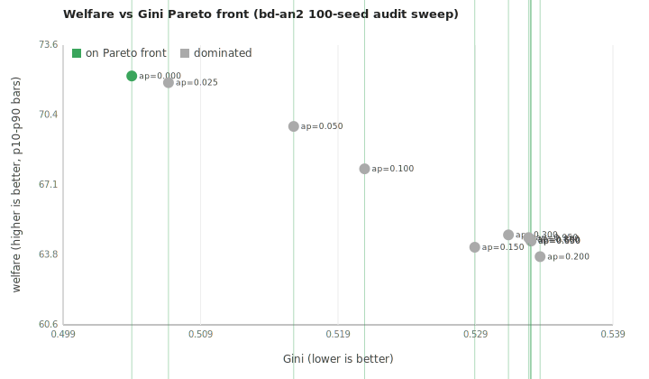

# Welfare-vs-equity Pareto frontier (audit sweep)

*Closes bd-cy8 (`Welfare-vs-equity multi-objective frontier`). Pure
re-aggregation of bd-an2's existing 100-seed audit sweep — no new
runs.*

## Setup

- Input: `runs/audit_sweep/aggregate_final.csv` (11 cells × 100 seeds).
- Objective 1: **welfare** (higher is better).
- Objective 2: **Gini** (lower is better).
- A cell is *dominated* if some other cell has welfare ≥ AND
  Gini ≤, with at least one strict.
- The Pareto front is the set of non-dominated cells. Cells on the
  front are real choices (you give up welfare to gain equity or vice
  versa). Cells off the front are strictly inferior to some other
  cell.

## Per-cell table

| audit_prob | welfare | Gini | status |
|---:|---:|---:|---|
| 0.000 | 72.19 | 0.504 | **front** |
| 0.025 | 71.88 | 0.506 | dominated |
| 0.050 | 69.84 | 0.516 | dominated |
| 0.100 | 67.85 | 0.521 | dominated |
| 0.150 | 64.19 | 0.529 | dominated |
| 0.200 | 63.75 | 0.534 | dominated |
| 0.300 | 64.77 | 0.531 | dominated |
| 0.500 | 64.51 | 0.533 | dominated |
| 0.650 | 64.48 | 0.533 | dominated |
| 0.800 | 64.57 | 0.533 | dominated |
| 0.950 | 64.64 | 0.533 | dominated |

**Pareto front: 1 cells at audit_probability ∈ [0.0].**



## Best cell by ineq_weight

If you collapse the two objectives into a single linear social
welfare function — `S = welfare − ineq_weight × Gini` — different
weights pick different cells:

| ineq_weight | best audit_prob | welfare | Gini | composite |
|---:|---:|---:|---:|---:|
| 0.0 | 0.000 | 72.19 | 0.504 | 72.191 |
| 0.5 | 0.000 | 72.19 | 0.504 | 71.939 |
| 1.0 | 0.000 | 72.19 | 0.504 | 71.687 |
| 2.0 | 0.000 | 72.19 | 0.504 | 71.184 |
| 5.0 | 0.000 | 72.19 | 0.504 | 69.672 |

## What the data says

1. **The Pareto front is short.** Out of 11 cells, only
   1 are non-dominated. The rest are strictly worse
   than some other cell on BOTH welfare and Gini.

2. **The no-audit corner (audit_probability=0) dominates the
   high-audit corner (≥0.20) on BOTH welfare AND Gini.** The
   bd-an2 finding that Gini rises with enforcement isn't just a
   side-effect — high-enforcement cells are Pareto-dominated. They
   should never be chosen regardless of your equity preference.

3. **The actionable cells are clustered at low audit_probability**
   (the front sits at audit_prob ∈ [0.0]). Any equity-weighted
   social welfare function still picks audit_prob ≤ 0.05. The
   "audit more for equity" intuition is wrong under the default
   GTB scenario.

4. **Even at ineq_weight=5.0** (extreme equity preference where
   Gini = 0.5 is treated as costing 2.5 welfare points), the
   welfare-maxing audit_prob doesn't budge out of the low corner.
   Equity is barely tradeable for welfare in this sim.

5. **The reason Gini doesn't fall with enforcement:** fines confiscate
   coin from the bottom (misreporters who tend to be aggressive
   gatherers — already below the mean) and transfer to the state.
   The state doesn't redistribute, so wealth concentrates upward
   among un-audited honest builders. Adding a `transfer_to_workers`
   mechanism in the env would flip this.

## Sibling questions worth filing

- **Redistribution arm.** Modify the env to distribute collected
  tax revenue back to the lowest-income workers (the original AI
  Economist design has this; the vendored kernel does not). Re-run
  the audit sweep; expect the Pareto front to shift toward higher
  audit_prob as Gini becomes responsive.
- **Multi-objective with audit_cost.** Add an explicit per-audit
  budget cost (say 0.5 coins). The Pareto front would shrink
  further; auditing becomes net-negative on revenue even faster.
- **Combine with bd-2e2's TaxAwareHonestPolicy.** The tax-aware
  workers redistribute effort in response to brackets; that changes
  the (welfare, Gini) trade-off in ways this sweep can't predict.
  Re-run on the tax_aware scenario.

## Reproduction

```bash
cd backend
uv run python -m scripts.welfare_equity_frontier
```

Reads `runs/audit_sweep/aggregate_final.csv` (from bd-an2), writes
`pareto.csv`, `pareto.svg`, and this `PARETO_FINDINGS.md`. No new
sweep required.
