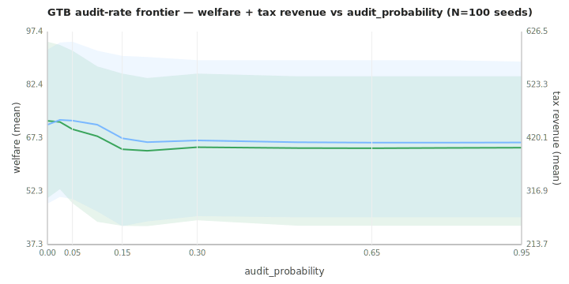

# Audit-rate sweep — auto-generated data view

Re-rendered from `aggregate_final.csv` at sweep time. **For
interpretation, see FINDINGS.md.** This file is overwritten on every
re-run; do not edit by hand.

## Final-epoch frontier (100 seeds per cell)

| audit_prob | audits | catches | tax_revenue | welfare | gini |
|---:|---:|---:|---:|---:|---:|
| 0.000 |    0.0 |   0.00 |  446.02 |  72.19 | 0.504 |
| 0.025 |    1.9 |   0.19 |  455.28 |  71.88 | 0.506 |
| 0.050 |    3.5 |   0.35 |  453.86 |  69.84 | 0.516 |
| 0.100 |    7.3 |   0.55 |  445.89 |  67.85 | 0.521 |
| 0.150 |   10.9 |   0.79 |  419.65 |  64.19 | 0.529 |
| 0.200 |   14.0 |   1.02 |  412.20 |  63.75 | 0.534 |
| 0.300 |   14.0 |   1.31 |  415.46 |  64.77 | 0.531 |
| 0.500 |   14.0 |   1.43 |  412.07 |  64.51 | 0.533 |
| 0.650 |   14.0 |   1.46 |  411.24 |  64.48 | 0.533 |
| 0.800 |   14.0 |   1.50 |  411.26 |  64.57 | 0.533 |
| 0.950 |   14.0 |   1.51 |  411.61 |  64.64 | 0.533 |

