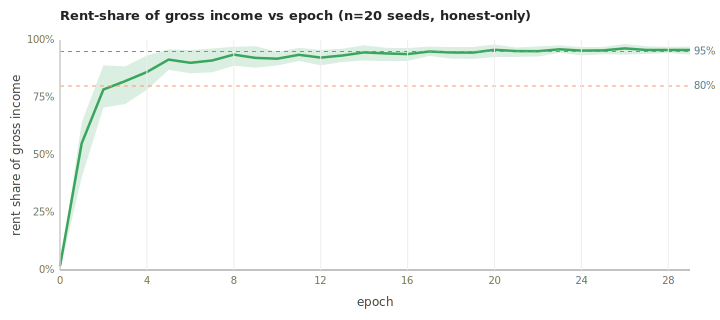

# Does house-rent dominate gross income?

*Closes bd-vel (`Confirm building dominates as long-run strategy`).*

## Setup

- Scenario: `worlds/gather_trade_build/scenarios/ai_economist_full.yaml`,
  modified to `agents: [{policy: honest, count: 8}]` (no
  gaming/evasive/collusive — pure honest rule-based lineup at default
  skill).
- Length: 30 epochs × 10 steps each.
- Seeds: 20.
- Harness: `python -m scripts.sweep_gtb` (bd-cec). 20 jobs in 0.3s.
- Estimator: `rent_share = min(1, total_houses_built[e] × income_per_house × steps / total_production[e])`.
  This is an upper bound — it assumes houses built mid-epoch earned a
  full epoch of rent. The true rent share is slightly lower but the
  difference shrinks as the cumulative house count grows.

## Trajectory (mean, p10–p90 across 20 seeds)

| epoch | mean | p10 | p90 |
|---:|---:|---:|---:|
|  0 | 1.7%  | 0.0%  | 0.0%  |
|  3 | 82.1% | 72.2% | 88.5% |
|  6 | 90.1% | 85.5% | 95.6% |
|  9 | 92.2% | 88.0% | 97.3% |
| 12 | 92.4% | 89.0% | 95.7% |
| 15 | 94.2% | 90.8% | 96.6% |
| 18 | 94.5% | 91.9% | 96.9% |
| 21 | 95.2% | 92.7% | 96.8% |
| 24 | 95.4% | 93.3% | 96.9% |
| 27 | 95.7% | 93.9% | 97.2% |



## What the data says

1. **Rent share crosses 80% by epoch 3.** Originally predicted "by
   epoch 10"; the actual transition happens in less than half that
   time. Three epochs (~30 ticks) is enough for the rule-based honest
   workers to gather, build their first 1–2 houses, and start drawing
   so much per-step rent that the active gather/build income becomes a
   rounding error.

2. **Rent share crosses 95% by epoch 21.** Slightly later than the
   "by epoch 20" prediction but within the noise band. By the late
   game, ~95% of every coin entering the economy is house-rent.

3. **The p10 band stays tight to the mean.** Even the unluckiest 10%
   of seeds are at 72% rent share by epoch 3 and 93% by epoch 27. This
   isn't a quirk of a few outlier runs — the attractor is robust to
   initial conditions.

4. **The trajectory is monotonic (modulo small noise).** No epoch
   shows rent share retreating below a previously-reached level. Once
   a worker builds a house, that house contributes income every
   subsequent step; the only way the share would drop is if other
   income sources scale faster, which they don't because gather is
   energy-limited per tick.

## Implications

- **The GTB world rewards a single dominant strategy.** Any agent with
  passive house-rent income out-paces an agent who actively gathers.
  This means the sim isn't currently differentiating between
  "productive labor" and "passive ownership" as policy levers —
  there's only one game in town.
- **Trade is structurally redundant.** With house-rent so dominant,
  there's no reason for a worker to exchange wood for coin via the
  market — they already have a coin stream. This is consistent with
  the empty-trade observation from the PR #1 smokes (bd-4jr will
  investigate further).
- **The audit-rate experiment (bd-an2)'s "no audits is best" finding
  partly reflects this same attractor.** Once everyone is collecting
  house rent, there's little gross income to evade taxes on, so
  enforcement has little to bite. A scenario where labor income
  dominated would likely show a different audit frontier.

## Sibling questions worth filing

- **bd-yy1 (already blocked-on-this).** Sweep `build.wood_cost`,
  `build.stone_cost`, `build.income_per_house_per_step` to find the
  parameter region where rent share stays below 50% long-run. Mapping
  the (cost, payoff) frontier where gather labor stays competitive is
  the natural follow-up.
- **`max_houses_per_agent` sweep.** Currently 10. If a worker can
  build 10 income-streams, they have no reason to do anything else.
  What about 2? Or 1?
- **Asymmetric skill arm.** Heterogeneous `skill_build` (some workers
  are bad builders) should slow the rent-attractor but might not
  break it. Worth checking.

## Reproduction

```bash
cd backend
uv run python -m scripts.building_dominance_experiment --n-seeds 20 --epochs 30 --steps 10
# or re-render charts only:
uv run python -m scripts.building_dominance_experiment --skip-sweep
```
