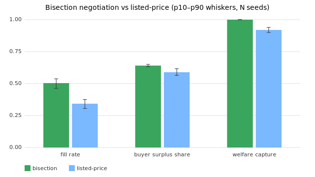

# Compute marketplace: bisection vs listed-price (N=100 seeds, 400 encounters/seed)

Metric (mean \| median \| p10 \| p90) | bisection | listed-price
--- | --- | ---
fill rate | 0.504 | 0.505 | 0.463 | 0.537 | 0.343 | 0.341 | 0.305 | 0.375
mean realized rate (coin/hr) | 3.720 | 3.726 | 3.599 | 3.844 | 3.442 | 3.440 | 3.304 | 3.581
buyer surplus share | 0.641 | 0.641 | 0.632 | 0.651 | 0.589 | 0.588 | 0.564 | 0.616
welfare capture | 1.000 | 1.000 | 1.000 | 1.000 | 0.920 | 0.921 | 0.900 | 0.939

_Auto-generated. Narrative interpretation lives in FINDINGS.md._