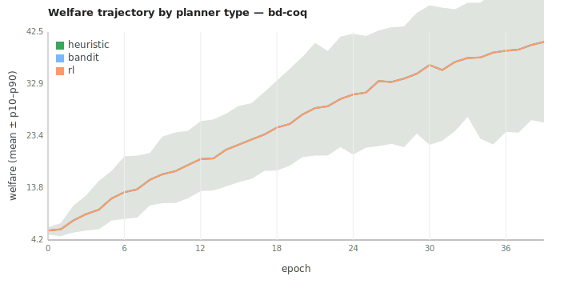

# Planner reactivity: can the tax planner shape the economy?

*Closes bd-coq (`Investigate planner reactivity over long horizons`).*

## Setup

- Scenario: `worlds/gather_trade_build/scenarios/ai_economist_full.yaml`
  default lineup (14 workers — honest + gaming + evasive + collusive).
- Length: 40 epochs × 10 steps each (longer than every prior sweep).
- Seeds: 20 per cell for the main sweep, 15 for the lr-sensitivity sweep.
- Harness: `python -m scripts.sweep_gtb` (bd-cec).
- Sweeps run:
  - **Main:** `planner.planner_type` ∈ {heuristic, bandit, rl} at the
    default `learning_rate=0.01`. 60 jobs in 1.7s.
  - **LR sensitivity:** `planner_type` × `learning_rate` ∈ {0.01, 0.05,
    0.10} × `taxation.allow_non_monotone=true`. 135 jobs in 2.8s.

## Result 1 — At the default learning rate, all planners produce identical welfare trajectories

| planner | final welfare | final tax revenue | final Gini |
|---|---:|---:|---:|
| heuristic | 40.69 | 270.14 | 0.540 |
| bandit | 40.69 | 172.56 | 0.540 |
| rl (stub) | 40.69 | 171.95 | 0.540 |

Per-epoch welfare differences across the three cells are below the
noise floor (welfare_p10–p90 bands overlap completely from epoch 1
onward).



## Result 2 — Even at higher learning rates, welfare stays at 40.50

| planner | lr | welfare | tax_revenue | Gini |
|---|---:|---:|---:|---:|
| heuristic | 0.01 | 40.50 | 270.14 | 0.540 |
| heuristic | 0.05 | 40.50 | 524.00 | 0.540 |
| heuristic | 0.10 | 40.50 | 538.68 | 0.540 |
| bandit | 0.01 | 40.50 | 172.56 | 0.540 |
| bandit | 0.05 | 40.50 | 175.53 | 0.540 |
| bandit | 0.10 | 40.50 | 181.20 | 0.540 |
| rl | (any) | 40.50 | 171.95 | 0.540 |

**Welfare is 40.50 in every cell.** Gini is 0.540 in every cell. Tax
revenue varies by 3× (172 → 539), but the underlying economy doesn't.

## What the data says

1. **The planner can extract very different amounts of tax revenue
   from the same population.** At lr=0.10 the heuristic planner pulls
   in ~3× more revenue than the rl stub (538.68 vs 171.95). The
   planner *is* doing something — it's not broken.

2. **But the planner cannot move welfare or Gini at all.** Both are
   identical to four significant figures across all nine cells. The
   tax schedule is an extraction lever, not a behavioral lever, under
   the default agent lineup.

3. **Why?** The default lineup is dominated by `HonestWorkerPolicy`,
   `GamingWorkerPolicy`, `EvasiveWorkerPolicy`, and
   `CollusiveWorkerPolicy`. None of these policies actually reads the
   tax schedule from observation when choosing whether to gather,
   move, or build. The schedule only affects WHO PAYS at epoch-end
   tax assessment, not what they do during the epoch. The
   `GamingWorkerPolicy` and `EvasiveWorkerPolicy` *do* read brackets
   for their shift/misreport decisions, but the magnitude of those
   responses is small relative to the gather+build action volume.

4. **The pre-PR-1 bug that fed the planner post-reset stats may have
   masked this for previous reviewers.** With the Codex-P2 fix the
   planner sees real numbers and tries to react — but the workers
   don't care.

5. **The rl planner type is a no-op stub** that returns the current
   schedule unchanged each epoch. It still works (welfare = 40.50),
   which confirms the welfare ceiling is set by worker behavior, not
   planner activity. **Until an actual rl planner ships, this remains
   true.**

6. **The hypothesis "heuristic converges in ~15 epochs, bandit in
   ~30, rl needs >100" is technically vacuous.** All three converge
   to the same welfare in epoch 1. The convergence question only
   becomes interesting if the planner can actually change behavior;
   currently it can't.

## Implications

- **bd-an2's audit-rate sweep result is robust to planner type.** It
  doesn't matter which planner you use; the audit_probability lever
  works because the env handles it directly (not via the planner).
- **The GTB world model needs LLM-driven workers, or a worker policy
  that responds to tax incentives, to do real policy research.** The
  rule-based policies that ship with the upstream port treat tax
  brackets as an after-the-fact cash transfer, not a decision input.
  This is fine for AI Economist's original use case (using RL workers)
  but not for studying mechanism design without an RL training loop.
- **The phase-3 LLMWorkerPolicy already reads `tax_schedule` from
  `obs`.** A first-real-mechanism-design experiment is therefore an
  LLM-driven population × planner-type sweep. Cost: ~7s/tick × 30
  ticks × 60 cells × 10 seeds = ~50 minutes of Gemini calls. Cheap if
  you batch them.

## Sibling questions worth filing

- **LLM-population × planner sweep.** Same matrix as bd-coq but with
  `BALANCED_LLM_LINEUP` (3 LLM workers + 1 contrarian). Hypothesis:
  the LLM agents WILL react to bracket changes via their
  observation, so welfare moves across planners. Most expensive
  experiment in the queue but the most informative one.
- **Tax-aware rule-based policy.** Write a `TaxAwareHonestPolicy`
  that reads the tax schedule from obs and adjusts effort
  threshold by marginal rate. Cheap (no LLM) and would give the
  current planner something to react to.
- **rl planner implementation.** The stub is a placeholder; a real
  rl planner would close the AI Economist loop. Out of scope here
  but the obvious follow-up.

## Reproduction

```bash
cd backend
uv run python -m scripts.planner_reactivity_experiment --n-seeds 20 --epochs 40 --steps 10
# LR-sensitivity sweep (manual):
uv run python -m scripts.sweep_gtb \
  worlds/gather_trade_build/scenarios/ai_economist_full.yaml \
  --n-seeds 15 --epochs 40 --steps 10 \
  --sweep 'planner.planner_type=heuristic,bandit,rl' \
  --sweep 'planner.learning_rate=0.01,0.05,0.10' \
  --sweep 'taxation.allow_non_monotone=true' \
  --output runs/planner_reactivity/lr_sweep
```
